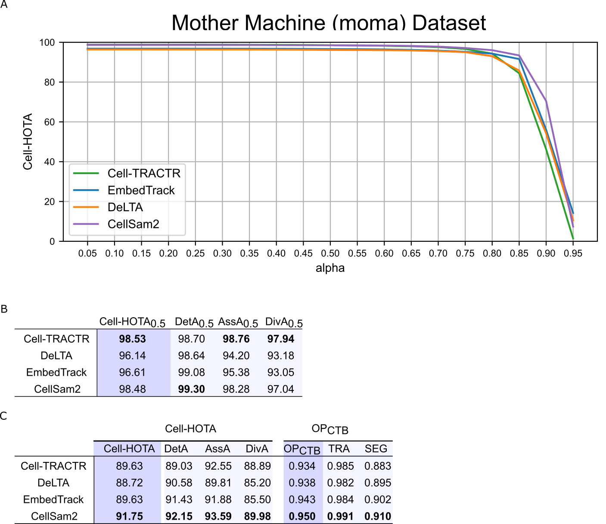

# CellSAM2: Cell Segmentation and Tracking with SAM 2

CellSAM2 is an adaptation of Meta's SAM 2 (Segment Anything Model 2) for biological cell segmentation and tracking in microscopy images and videos. This project extends SAM 2's capabilities to handle the unique challenges of cell segmentation and tracking, including cell division events, varying morphologies, and dense cell populations.

CellSAM2 is memory constrained to work on larger images. Future work will entail adapting CellSAM2 to handle larger images.

## 📋 Checklist

### Documentation & Notebooks
- [ ] Run training Colab notebook in full
- [ ] Run inference Colab notebook in full

### Training Experiments
- [ ] Train MOMA on tracking (with finalized code)
- [ ] Train DynamicNuclearNet on tracking
- [ ] Save MOMA and DynamicNuclearNet model checkpoints on Zenodo
- [ ] Train segmentation model on moma as proof of concept

## Overview

CellSAM2 leverages the powerful foundation of SAM 2 and adapts it specifically for:
- Accurate cell instance segmentation in microscopy images
- Robust cell tracking across video frames
- Handling cell division events
- Processing Cell Tracking Challenge (CTC) formatted data

It currently supports CTC-formatted data for training and CTC-formatted data or TIFF files for inference.

## Results

CellSAM2 achieves state-of-the-art performance on the moma dataset, outperforming 3 other leading cell tracking models across multiple metrics:

### Performance Metrics
- **Cell-HOTA**: Outperforms competing models on the Cell-HOTA metric for cell tracking accuracy
- **CTC Score**: CellSAM2 achieves superior performance on the Cell Tracking Challenge (CTC) evaluation metrics




## 🚀 Getting Started

| Task        | Link |
|-------------|------|
| 🔧 Training | [Colab Notebook](https://colab.research.google.com/drive/1I9HCPukpnXtm0HW7isccpsdAnOjkt0mo#scrollTo=BxvFxpDehhR6) |
| 📈 Inference | [Colab Notebook - Coming Soon]() |

### Data Format

CellSAM2 supports data in the Cell Tracking Challenge (CTC) format. For detailed data format specifications and examples, see [training/README.md](training/README.md).

## Installation

CellSAM2 requires Python >=3.10, PyTorch >=2.5.1, and TorchVision >=0.20.1.

### Local Installation

```bash
# Clone the repository
git clone https://github.com/yourusername/CellSam2.git
cd CellSam2

# Create and activate a conda environment (recommended)
conda create -n cellsam2 python=3.10
conda activate cellsam2

# Install CellSAM2
pip install -e .
```

### Development Setup

For development, install with the `dev` extras:

```bash
pip install -e ".[dev]"  # or "[notebooks,dev]" if you need notebook support
```

Then set up the pre-commit hooks:

```bash
pre-commit install
```

## Model Checkpoints

Download the pretrained SAM2 model checkpoints:

```bash
cd checkpoints
./download_ckpts.sh
cd ..
```

## Training and Inference

### Training

You can train CellSAM2 for either tracking or segmentation tasks. The default mode is tracking.

```bash
# For cell tracking (default)
python train_ctc.py \
  launcher.experiment_log_dir=sam2_logs/CellSam2-tracking \
  scratch.dataset_name={dataset} \
  dataset.data_dir={dataset_path}

# For cell segmentation (single frame)
python train_ctc.py \
  launcher.experiment_log_dir=sam2_logs/CellSam2-tracking \
  scratch.dataset_name={dataset} \
  dataset.data_dir={dataset_path} \
  scratch.num_frames=1
```

For detailed training options and configurations, see [training/README.md](training/README.md).

### Inference

The basic command structure for inference is:

```bash
python inference/track_cells.py --video_path PATH --model_name MODEL --res_path OUTPUT
```

**Note:** Output is currently in CTC format only.

#### Basic Examples

For cell tracking:
```bash
python inference/track_cells.py \
    --video_path data/moma/test/CTC \
    --model_name CellSam2-model \
    --res_path results/tracking
```

For cell segmentation:
```bash
python inference/track_cells.py \
    --video_path data/moma/test/CTC \
    --model_name CellSam2-model \
    --res_path results/segmentation \
    --segment True
```

#### Command Arguments

Required arguments:
- `--video_path`: Path to your CTC-formatted data
- `--res_path`: Output directory for results

Optional arguments:
- `--model_name`: Name of the model to use (default: "CellSAM2-model")
- `--segment`: Enable segmentation mode (default: False)
- `--checkpoint_num`: Specific checkpoint number to use (default: None, uses latest)
- `--use_heatmap`: Whether to use heatmap prediction (default: True)

Advanced parameters:
- `--box_nms_thresh`: Non-maximum suppression threshold for bounding boxes (default: 0.5)
- `--pred_iou_thresh`: IoU threshold for predictions (default: 0.7)

## Citation

This project builds upon SAM 2. If you use CellSAM2, please cite the original SAM 2 paper:

```bibtex
@article{ravi2024sam2,
  title={SAM 2: Segment Anything in Images and Videos},
  author={Ravi, Nikhila and Gabeur, Valentin and Hu, Yuan-Ting and Hu, Ronghang and Ryali, Chaitanya and Ma, Tengyu and Khedr, Haitham and R{\"a}dle, Roman and Rolland, Chloe and Gustafson, Laura and Mintun, Eric and Pan, Junting and Alwala, Kalyan Vasudev and Carion, Nicolas and Wu, Chao-Yuan and Girshick, Ross and Doll{\'a}r, Piotr and Feichtenhofer, Christoph},
  journal={arXiv preprint arXiv:2408.00714},
  url={https://arxiv.org/abs/2408.00714},
  year={2024}
}
```


If you find CellSAM2 useful in your research, please consider citing:

```bibtex
@software{CellSAM2,
  title={CellSAM2: Cell Segmentation and Tracking with SAM-2},
  author={Owen O'Connor},
  year={2025},
  url={https://github.com/owen24819/CellSam2},
  note={GitHub repository}
}
```


